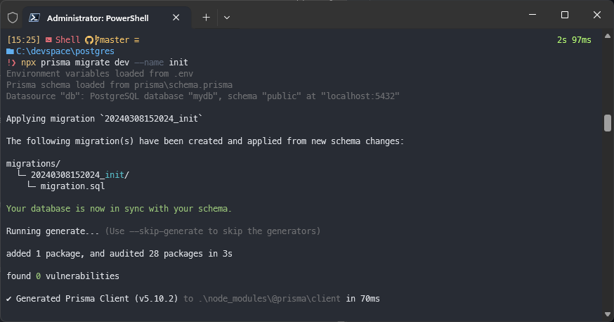

# stuff
- https://www.prisma.io/docs/getting-started/quickstart
- https://www.prisma.io/docs/orm/overview/databases/postgresql
- https://hub.docker.com/_/postgres

## steps
- init node project: `npm init -y`
- install req. npm ackages: `npm install typescript ts-node @types/node --save-dev`
- init typescript: `npx tsc --init`
- install prisma: `npm i prisma --save-dev`
- verify installlation: `npx prisma`
- initialize prisma for postgres: `npx prisma init --datasource-provider postgresql`
- run docker compose `docker-compose up -d` (based on docker-compose.yml)
- `docker ps`
- access docker bash from container: `docker exec -it 923d51b9ec4b /bin/bash`
- run psql command on docker bash: `psql -U postgres -d mydb`
- add db schemas @ schema.prisma
- migrate db schema (create/update tables): `npx prisma migrate dev --name init`
- migrate adds `"@prisma/client": "^5.10.2"`as dependency

## docker-postgres cmds
- `\q`: exit psql (postgres)
- `exit`: exit docker bash

## screens
docker compose and docker ps:

access docker and postgres after init:

show tables of initialized db:

migrate the added database schema (tables)

show tables after migration:

